# VFX Editorial Pipeline

**TL;DR This pipeline was built over about 15 months for an animation studio. This particular pipeline works for live action > CG > full rotoscoped pipeline (Think A Scanner Darkly or Waking Life art style).

The project involved our studio and 2 different vendors, and artists in like 4 different continents; so it was very important that we automate movement of all files to ensure standardization and consistency of data delivery.
Ultimately what you see in this repo would send and receive all files to vendors and from vendors, update and sync all Shotgrid instances (there were 2), and automatically generate a brand new timeline for the editor so they never had to waste time importing new shots and cutting into the timeline. This was completely ran on Python; and made it incredibly simply to re-configure and deploy on new shows when the studio brought in new projects.

If you're interested in deploying a similar round-trip file delivery system and timeline automation on your show google me up and give me a call.**


OK! Now on to the in-depth explanation:

Eleven tools built for a 1700+ shot feature blending live-action, rotoscoping, and multiple CG layers per shot, split into five groups. Four chain together on the ingest/build side to do the following:

- one turns an editor's full-movie timeline export into per-shot reference XMLs
- one builds the shot folder structure and stamps a starting Nuke comp for every shot
- one stamps the show's per-pass Nuke templates (live-action roto, CG beauty, director's review comp) once there's real content to point at,
- and one switches which show's Nuke toolset an artist's machine loads. 

Three more form a vendor round-trip: 
- pulling finished CG renders in from the CG vendor 
- forwarding approved work out to the roto vendor
- and ingesting whatever comes back
- publishing it to ShotGrid for director review along the way. 

One closes the loop back to the editor — pulling newly finished comps out of ShotGrid and the shot tree and rebuilding a Premiere-importable timeline out of them, so the edit stays current without anyone dragging files in by hand.

Two are smaller, more bespoke pieces reconciling the studio's ShotGrid with the CG vendor's own separate site — one for status fields, one for the actual review conversation (notes and attachments) — both existing on this show for scheduling reasons, not by design. 

The last is a standalone utility for the day a shot's own number has to change after the fact.

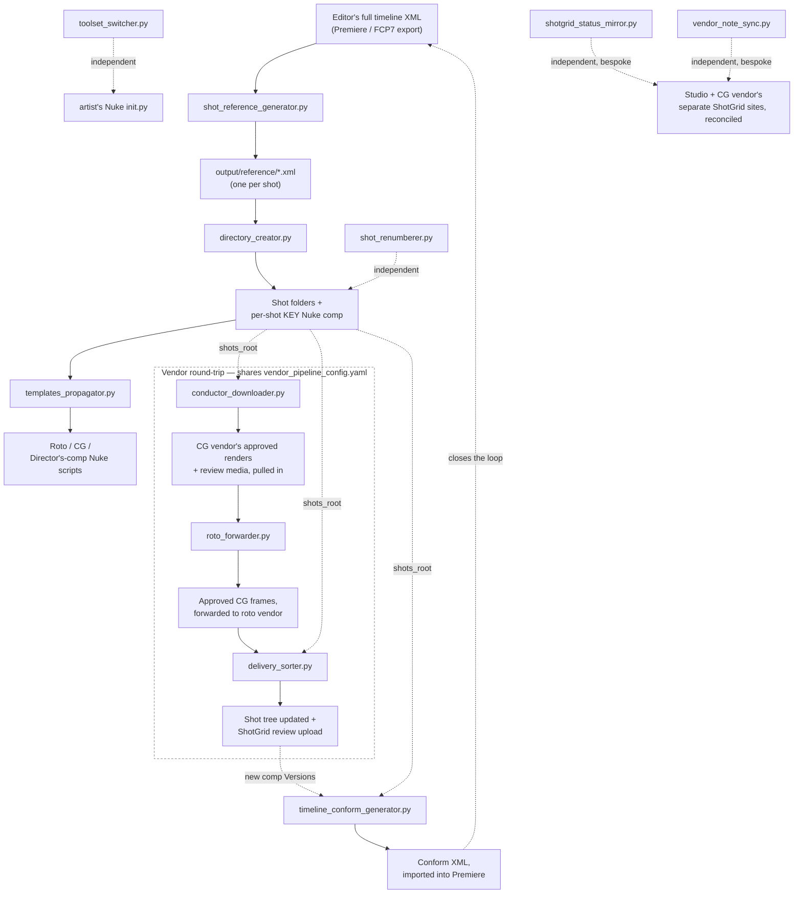

## Setup

```
pip install -r requirements.txt
```

The four tools above the divider are self-contained and fully tested (pure filesystem + XML/text logic, no external services). The vendor round-trip and `shotgrid_status_mirror.py` below it need a live ShotGrid connection — and, for `conductor_downloader.py`, the Conductor CLI installed and authenticated — see those sections for what's actually been verified versus what's ported-but-unverified.

All four tools take a `--config path.yaml`. Copy the provided config files and edit them for your own show's naming convention, storage layout, and folder schema — see each tool's section below for what to change.

---

## Naming convention

Every scene and shot in this pipeline is coded `<PROJECT>_<SCENE-NUM>_<SCENE-CODE>_Sh<SHOT-NUM>` — for example, the screenshots later in this README use `DMO_070_NGHT_Sh0080` (`DMO` the film, `070` the scene number, `NGHT` the scene code, `Sh0080` the shot number).

So for example the famous D-Day opening scene in Saving Private Ryan might be:

SPR_010_DDAY_Sh0010

SPR_010_DDAY_Sh0020

SPR_010_DDAY_Sh0030

But for today we're just dealing with DMO.

- **The project code is fixed-length for the entire production** — 3 letters on the show this pipeline was built for (`DMO` in the screenshots below). This repo's own config files and code examples use the readable placeholder `SHO` — swap in your own show's real, fixed-length code.
- **The scene code is also fixed-length for the entire production** — 4 letters here (`NGHT`, `ZOOM`, `HOME`, `DRVE`...; this repo's docs use the placeholder `SCEN`). The exact length is a pipeline-TD call, not a hard rule — some shows use 5 — but whatever it's set to, every scene code on the show has to be that same length, or the filename-parsing logic every tool in this pipeline relies on (scene/shot splitting, sorting, ShotGrid lookups) starts breaking in inconsistent, hard-to-spot ways.
- **Scene and shot numbers always end in a padding zero** — `070`, not `071`; `Sh0080`, not `Sh0081`. This is the single most load-bearing convention in the whole scheme: it exists so a pickup or reshoot scene can be inserted later without renumbering anything already shipped. If `SHO_050_HOME` and `SHO_060_OFFC` already exist and a pickup needs to land between them, it becomes `SHO_055_...` — nothing that already references `050` or `060` (files, ShotGrid entries, vendor deliveries) has to change. A second pickup landing between `050` and `055` becomes `SHO_052_...`, and so on — the padding is what leaves the room. The same logic applies to shot numbers within a scene. `shot_reference_generator.py`'s `number_step` config field (default 10) is what enforces this — see its section below.
- **Never bolt an ad-hoc suffix onto a code to dodge a numbering conflict** (`SHO_050a_...`, `SHO_050b_...`) — it breaks the fixed-length assumption every tool here relies on to parse a code. Use the padding gap instead.

Below is a real folder listing showing this convention in practice — scenes `010` through `090`, including `DMO_055_DRVE`, a pickup scene sitting exactly where it should between `050` and `060`:

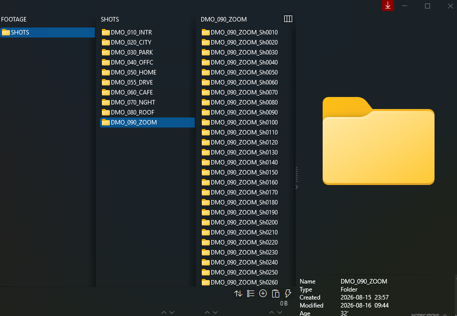

---

## shot_reference_generator.py

Allows export all shots individually capability for Adobe Premiere. This is not native in Premiere and basically acts as DaVinci Resolves "Export as Individual Clips" setting.

Splits a full editorial timeline export into many XMLs, with each shot in it's OWN XML, each pointing at the real native camera file instead of the offline editorial proxy.

The purpose of this is so then the editor can bring all of these individual XMLs and drag them back into Premiere (Or directly into the Media Encoder queue) and export each shot as it's own video file.

In the end we did NOT use this tool to ship for limitations at the bottom of this section; however it still comes in handy occasionally.

Further explanation of methodology:

After the editor has cut the entire movie in Premiere and exported the sequence as a single Final Cut Pro 7 XML. This script reads that file and, for every shot on the timeline:

- resolves shot boundaries from the raw multi-track edit (collapsing overlapping clips, handling Premiere's `-1` sentinel timing on clips adjacent to a transition)
- names each shot from a scene-marker track plus a running shot number (`SHO_010_SCEN_Sh0010`)
- rewrites the clip's editorial-proxy path to the real native camera file, following the on-set storage convention
- pads the shot with a few frames of handle
- splices in a burn-in graphics layer
- writes it out as a standalone, single-clip Premiere sequence
- explodes any shot that ended up with more than one overlapping clip (e.g. a screen composited into another shot) into separate per-layer files

Below is an example of the burn-in graphic this tool splices onto every plate — source timecode, camera roll, shot code, frame number. The examples below use an actual shot code rather than the generic `SHO_NNN_SCEN` pattern above: **DMO** is the shortened name of the film, **NGHT** is short for "Night," the scene that takes place at night, and **ZOOM** is short for "Zoom call," a different scene later in the film.

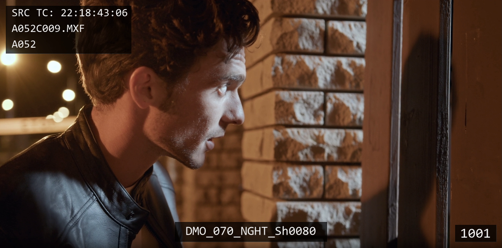

And the multi-layer split this tool performs when a shot turns out to be more than one overlapping element — here, a plate shot against green screen (Layer01), the element composited into it (Layer02), and the result once they're combined (MERGED):

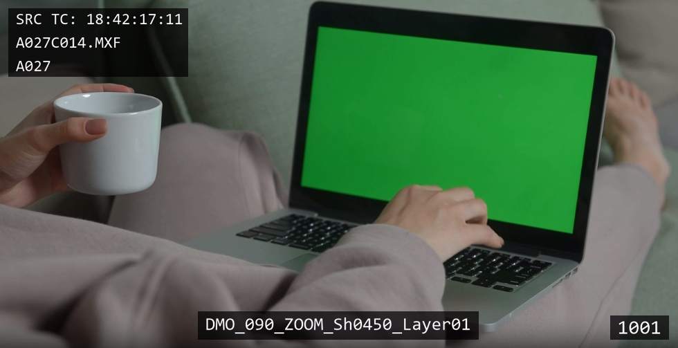
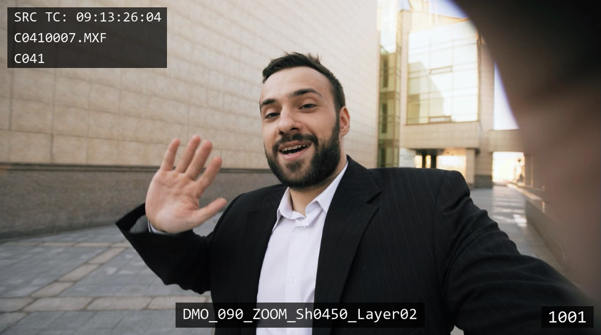
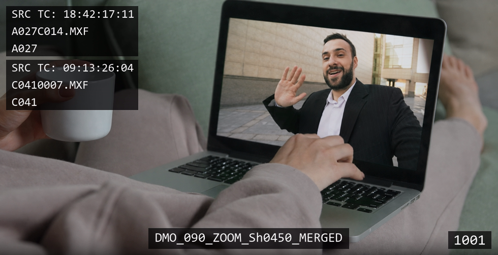

And the same shot's final delivered comp, without the reference burn-in:


**What this was actually for, and why it's not what shipped:** the plan was to batch-import all ~1700 of these XMLs and batch-export through Adobe Media Encoder, so every shot would land pre-named and ready for vendors without anyone touching Premiere by hand. The footage was shot in a log color space (S-Log3) to preserve dynamic range for color correction later — Media Encoder's batch export couldn't preserve that latitude, so the result looked plausible at a glance but was really just the flat log image with no real correction, dynamic range lost. That final step ended up being done in DaVinci Resolve instead. The XML-generation logic here is the real, working half of that idea. See [docs/shot_reference_generator_case_study.md](docs/shot_reference_generator_case_study.md) for the full version history behind this tool — it went through nine iterations before landing here.

Edit `config.yaml` for your own show: shot-code prefix, which video track your editor uses for scene markers, handle length, the numbering step between scenes/shots (default 10 — see [Naming convention](#naming-convention) above for why), your storage server hostname, and the native-camera-file convention (this defaults to Sony XDCAM's `XDROOT/Clip` layout — adjust if your cameras deliver differently). Shot numbers reset at the start of every new scene, matching the studio convention this tool was built against.

```
python shot_reference_generator.py --input-xml /path/to/full_timeline_export.xml --config config.yaml
```

Output lands in `output/reference/` (one XML per shot) and `output/reference/Raw_XML/` (per-layer splits for multi-clip shots).

**Known limitations:**
- FCP7/Premiere XML has a quirk where several clips can share a single `<file>` node instead of each having their own. There's a fallback path for it, but it's only been exercised against synthetic test data, not a real production export — if you hit an edge case, that's the first place to look.
- The shot-collapsing pass is O(n²) over clips on the timeline. Fine for a one-shot batch run over a few thousand clips; not written for anything hotter than that.

---

## directory_creator.py

Builds the full per-shot folder tree and stamps a starting Nuke comp for every shot, driven by the reference XMLs `shot_reference_generator.py` produces. (Or, again, the simplest method is to just export using DaVinci Resolve's Export Individual Clips feature)

For each shot it:

1. reindexes any 0-indexed exported frame sequence so Nuke's 1-based frame range convention isn't broken (renaming through a temporary marker to avoid collisions, and normalizing the frame-number connector from `_` to `.` to match the rest of the pipeline's naming)
2. builds the per-shot folder tree — plates, CG passes/variants/versions, comp, Nuke — and copies the matching exported frames in
3. stamps a per-shot copy of a KEY Nuke template with that shot's output path, duration, and source-plate path

Edit `directory_creator_config.yaml` for your own show: the folder schema (base directories plus the CG pass/variant/version matrix), storage paths, and project prefix. `templates/key_template_example.nk` is a minimal placeholder, not the real production template (that file wasn't part of what got archived) — swap in your own as long as it keeps the three tokens the script substitutes: `X:/PROJECT_FILE.nk`, `_DURATION_`, `X:/SOURCE_FILE.exr`.

```
python directory_creator.py --config directory_creator_config.yaml
```

By default `xml_folder` in the config points at `shot_reference_generator.py`'s own `output/reference/` — run that tool first, or point it at wherever your reference XMLs actually land.

### Per-shot folder taxonomy

The schema below is exactly what `directory_creator_config.yaml`'s `base_shot_dirs`/`cg_bg_*` fields generate — the CG branch is a real combinatorial matrix (2 groups × 4 passes × 3 variants × 2 versions = 48 folders per shot), shown here as one expanded branch plus the pattern rather than all 48:

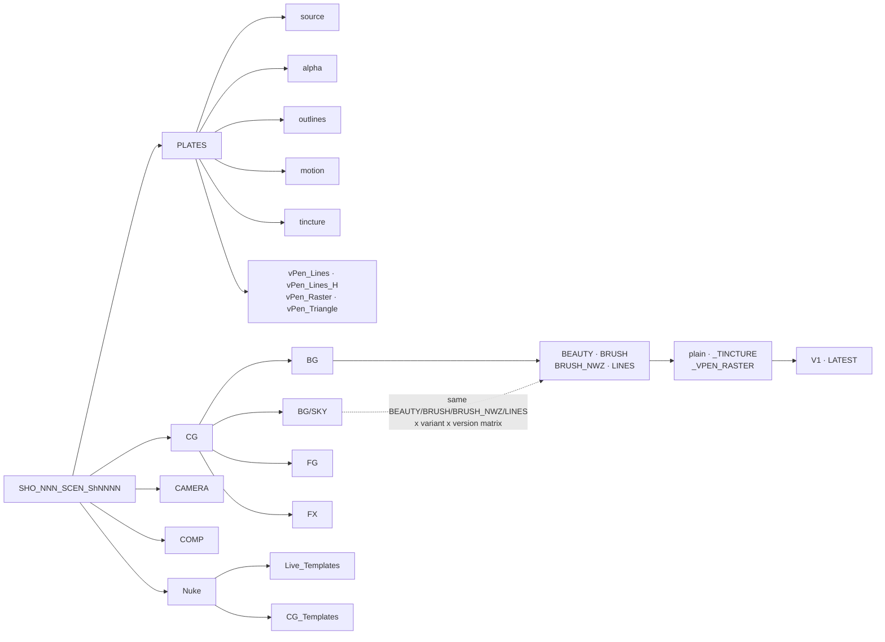

A real example of this same structure, browsed directly — see [Naming convention](#naming-convention) above for what `DMO`/`NGHT`/`ZOOM` mean:

Below is where artists find a shot's reference footage — a burned-in `.mov` living in `_Reference`, playing back correctly since it's a real rendered clip, not just a renamed image:

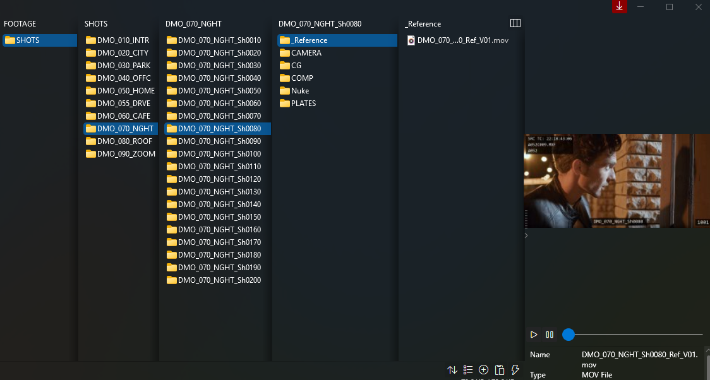

Below is where the stamped Nuke comp for a shot lands — `Nuke/Live_Templates`, matching `directory_creator.py`'s `write_key_comp()`:

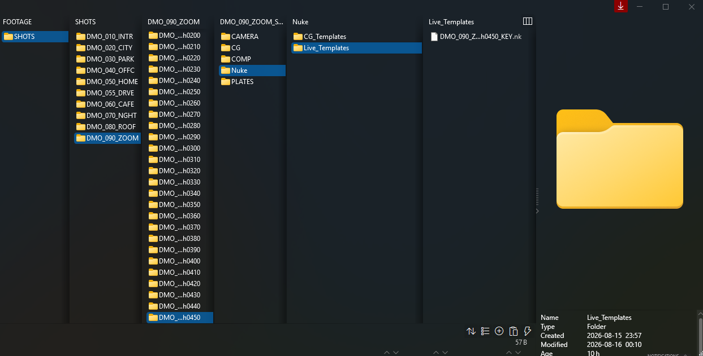

Below is the full `PLATES` subfolder breakdown, and a multi-layer shot's `Layer01` EXR sequence inside `PLATES/source` — 150 frames, with a camera report sitting alongside them:

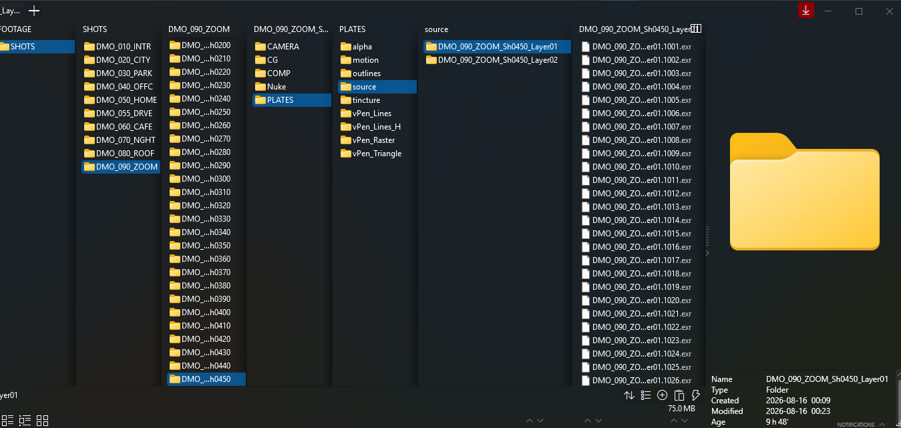

Below are Multi-layer shot examples (e.g. a screen composited into another shot) get their plates split per layer — matches the layer-splitting `shot_reference_generator.py` already does on the editorial side. The matching `Layer02` sequence for the same shot:

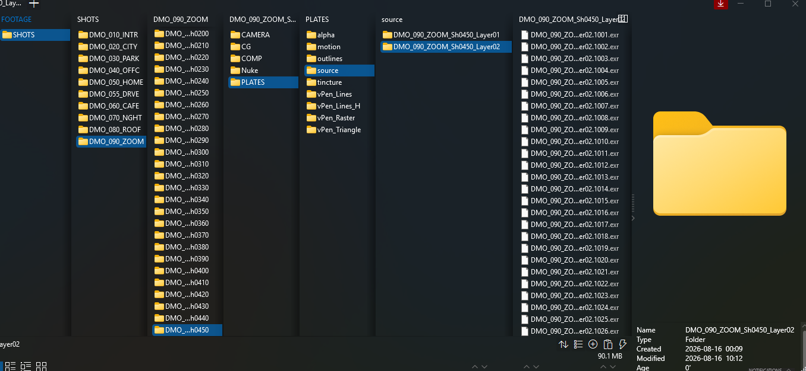

---

## templates_propagator.py

Stamps per-shot Nuke comp scripts from a master template, across the whole show — the step that runs once plates/roto/CG elements actually exist to point at, later than `directory_creator.py`'s starting KEY comp. Three modes, one per template:

- **`roto`** — the live-action roto/paint comp. Auto-detects each shot's frame range straight off its `PLATES/source` EXRs, and handles multi-layer plates (e.g. a screen composited into another shot) by stamping one script per layer.
- **`cg`** — the CG background/foreground beauty-pass comp. One template drives both passes; the script substitutes BG or FG into the same token set and writes both.
- **`directors-comp`** — a review comp built from each shot's latest approved COMP version, with its frame range and render sequence auto-discovered from what's on disk. Never overwrites an existing script — if one's already there, it writes the next version instead, so re-running it as new comp versions land is safe.

`roto` and `cg` are meant to run across the whole show. `directors-comp` is meant to run selectively — directors ask for an updated comp on specific shots, not all 1700 at once — so pass `--shots` to target specific ones, or omit it to run against everything the naming convention discovers.

```
python templates_propagator.py --mode roto --config templates_propagator_config.yaml
python templates_propagator.py --mode cg --config templates_propagator_config.yaml
python templates_propagator.py --mode directors-comp --config templates_propagator_config.yaml --shots SHO_010_SCEN_Sh0010
```


**On the templates:** `templates/directors_comp_template.nk` is the real production template, built from native Nuke nodes only. `templates/roto_plate_template_example.nk` and `cg_template_example.nk` are minimal placeholders, not the real ones — the actual templates drove a proprietary third-party rotoscope toolset (custom compiled Nuke plugin nodes, not a portable Gizmo) that isn't available or redistributable. Swap in your own template for those two modes as long as it keeps the tokens listed in `templates_propagator_config.yaml`.

**How proven each mode is, going by the original run logs:** `directors-comp` has the strongest evidence — real runs spanning nearly a year, ~1,700 shots referenced, zero fatal errors, visible version-increment behavior across many re-runs on the same hero shot. Both `cg` and `roto` were validated and the logic is real, but was not put into production often.

---

## toolset_switcher.py

Switches which show's Nuke toolset an artist's local `~/.nuke/init.py` loads — for a studio running more than one show at a time on shared workstations, each with its own custom gizmos/plugins/menu items registered via a single `nuke.pluginAddPath()` call.

```
python toolset_switcher.py showa --config toolset_switcher_config.yaml
python toolset_switcher.py showb --config toolset_switcher_config.yaml
```

This tool is one script, config-driven, that generalizes the swap properly. Given the full set of known toolset paths, it replaces whichever one is currently active with the requested one — adding a fresh line if none is active yet. Adding a new show is a one-line config edit, not a new script.


---

## The vendor round-trip

Two outside vendors worked this show — a CG vendor rendering on their own farm via Conductor (a cloud rendering service) with review on their own separate ShotGrid site, and a roto vendor doing paint/roto work once CG was approved. Getting work to and from both, and publishing whatever came back for director review, was three tools:

**`conductor_downloader.py`** — pulls the CG vendor's approved review media down from their ShotGrid, republishes it as a Version on the studio's own ShotGrid linked to the right Shot/Task, then pulls the matching full-resolution EXR sequences down from Conductor directly, and finally scans everything it touched for missing frames.

```
python conductor_downloader.py "ReviewBatch_2024-01-15" --config vendor_pipeline_config.yaml
```

**`roto_forwarder.py`** — once a CG render is marked approved on the studio's ShotGrid, finds where its rendered frames actually live (already staged from the prior step, or by searching the shot's CG folder directly) and copies them to where the roto vendor picks up work.

```
python roto_forwarder.py "ReviewBatch_2024-01-15" --config vendor_pipeline_config.yaml
```

**`delivery_sorter.py`** — ingests whatever a vendor delivers back: auto-extracts any `.rar`/`.zip` archives, routes every file into the right shot's folder by parsing its filename, and for movie files, creates and uploads a ShotGrid Version to a review playlist. Which vendor a delivery is from is inferred from its source path (a folder name marker, configured in `vendor_paths`).

```
python delivery_sorter.py "path/to/delivery" "PlaylistName" --config vendor_pipeline_config.yaml
```

(`PlaylistName` is optional — omit it and one gets generated from the vendor and today's date, matching the original.)


---

## timeline_conform_generator.py

The other end of the loop `shot_reference_generator.py` starts: that tool splits the editor's locked cut apart into per-shot XMLs sent out to vendors; this one pulls finished work back in and rebuilds a timeline out of it. On a show taking daily deliveries, a vendor might land anywhere from a handful to a few hundred finished comps at once — dragging each one into the edit by hand, at the right spot, trimmed to the right length, doesn't scale. This tool queries ShotGrid for comp Versions created in a date range, finds their rendered files on the shots drive, and clones each shot's position straight out of the picture-locked template timeline — trimming in/out points to match whatever frame count the new file actually has — into a fresh XML the editor drags straight into Premiere.

```
python timeline_conform_generator.py 20240130 20240615 --config timeline_conform_generator_config.yaml
```

`end_date` is optional and defaults to today. Multiple new versions of the same shot landing in one date range stack onto separate video tracks instead of overwriting each other, so an editor can compare versions side by side rather than only ever seeing the latest — and previous XMLs are archived rather than overwritten each run.

**Worth being clear about, since it's easy to assume otherwise:** this generates a snapshot of the most up-to-date shot versions at the time the script is run. If something is delivered 15 minutes later, it is not included. So best to schedule this to run at a particular time of day agreed upon with production, i.e. "usually we receive deliveries at 9am from the vendor, let's plan on running this script every day around 10am and ping the editor to import once it is complete"


---

## shotgrid_status_mirror.py

The smallest and most bespoke tool here, and the one that exists because of a scheduling problem: the CG vendor needed to start work before the studio's own ShotGrid instance was ready, so the vendor stood up their own separate site in the meantime. That left two ShotGrid instances tracking the same show, which someone had to reconcile by hand every day so the vendor's approvals, rejections, and notes actually showed up on the studio's side. This tool automates that reconciliation. In hindsight, one shared instance from the start would have avoided the problem entirely — this is a fix for a scheduling gap, not something to reach for by default.

Two modes:

```
python shotgrid_status_mirror.py --mode tasks --config vendor_pipeline_config.yaml
python shotgrid_status_mirror.py --mode versions --config vendor_pipeline_config.yaml
```

- **`tasks`** — mirrors the status of a named Task (e.g. "Tracking") from the vendor's site onto the studio's, per shot. Vendor status codes get translated through a configurable map (`task_mirror.vendor_status_map`) since the two sites don't necessarily share short-code conventions. A shot whose studio status is in `task_mirror.studio_skip_statuses` is left alone even if the vendor disagrees — that's how the studio protected shots it was holding in an internal review pass. If the vendor no longer has the Task, the studio's stale copy is deleted; if the vendor has a Task the studio doesn't, it's logged as a flag for a human, not auto-created.
- **`versions`** — the same idea, applied to Version status instead of Task status.

`tasks` is the one that actually ran hourly in production for about five months, with a clean run log throughout (zero errors logged across roughly 1,000 runs). `versions` was built but ran far less frequently.


---

## vendor_note_sync.py

A level up from `shotgrid_status_mirror.py`: that tool mirrors status fields between the studio's ShotGrid and the CG vendor's separate site; this one mirrors the actual review conversation — Version status, a Task-status cascade, and the notes and attachments reviewers actually left — for one review playlist.

```
python vendor_note_sync.py "ReviewBatch_2024-01-15" cg --config vendor_pipeline_config.yaml
python vendor_note_sync.py "ReviewBatch_2024-01-15" tracking --config vendor_pipeline_config.yaml
```

For the CG vendor: a client-approved Version gets marked `approved` on the studio side and cascades the shot's Lighting task to finished; a Version with open notes but no approval gets marked "needs touch-up" and cascades Lighting to in-progress. For a tracking vendor, status is mirrored straight across — no task cascade, since their status codes already matched the studio's own convention. Either way, every open note on the vendor's Version gets reformatted from the vendor's own `"{date} {initials} {version} - {comment}"` convention into `"[{date} {initials}] {comment}"`, copied onto the matching studio Version along with any attachment the reviewer included, and skipped if it's already there — safe to re-run.


---

## shot_renumberer.py

A standalone utility for the day a shot's own number has to change — a new shot gets inserted where there wasn't room for one, for instance. Renames every rendered/comp file (EXR, mov, mp4, png) in a shot's folder that carries the old shot code, and separately rewrites the old code everywhere it appears inside the shot's own Nuke scripts — both the script's filename and any node inside it that references the old code by name.

```
python shot_renumberer.py path/to/SEQ/SEQ_Sh0010 SHO_001_INT_Sh0010 SHO_001_INT_Sh0015 --config shot_renumberer_config.yaml
```

Camera-original source and reference footage are left alone — anything sitting inside a folder named for one of `skip_folder_markers` in the config (source, reference footage) is skipped, since that material predates the renumber and shouldn't be touched.

---

## License

[PolyForm Noncommercial 1.0.0](LICENSE) — free to view, run, and evaluate for any noncommercial purpose (including using it to evaluate me as a hire). Commercial use requires reaching out first.

